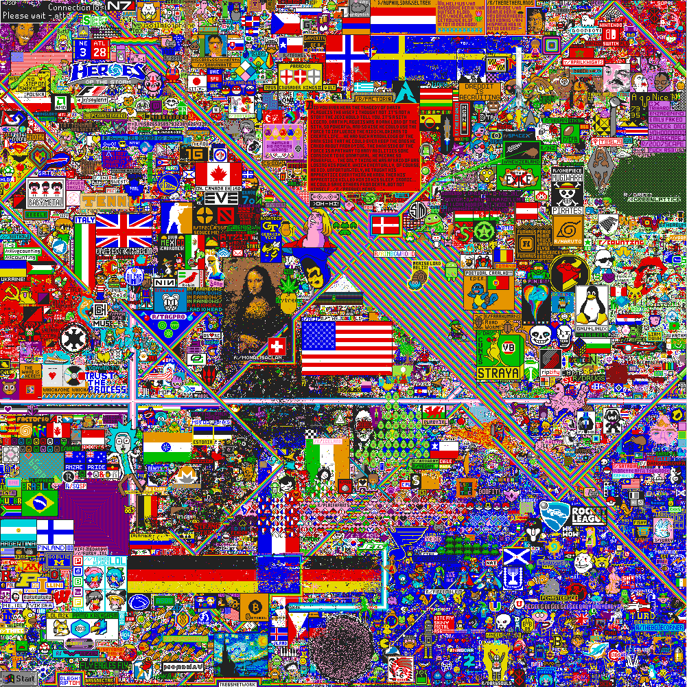

# canvas
**canvas** is a game and a radical social experimentation in stake decentralization. We use elements of entertainment, scarcity, competition, and economics to incentivize voting power distribution of a proof-of-stake blockchain.



## Get started

```
ignite chain serve
```

`serve` command installs dependencies, builds, initializes, and starts your blockchain in development.

### Configure

Your blockchain in development can be configured with `config.yml`. To learn more, see the [Ignite CLI docs](https://docs.ignite.com).

### Web Frontend

Ignite CLI has scaffolded a Vue.js-based web app in the `vue` directory. Run the following commands to install dependencies and start the app:

```
cd vue
npm install
npm run serve
```

The frontend app is built using the `@starport/vue` and `@starport/vuex` packages. For details, see the [monorepo for Ignite front-end development](https://github.com/ignite/web).

## Release
To release a new version of your blockchain, create and push a new tag with `v` prefix. A new draft release with the configured targets will be created.

```
git tag v0.1
git push origin v0.1
```

After a draft release is created, make your final changes from the release page and publish it.

### Install
To install the latest version of your blockchain node's binary, execute the following command on your machine:

```
curl https://get.ignite.com/username/canvas@latest! | sudo bash
```
`username/canvas` should match the `username` and `repo_name` of the Github repository to which the source code was pushed. Learn more about [the install process](https://github.com/allinbits/starport-installer).

## Learn more

- [Ignite CLI](https://ignite.com/cli)
- [Tutorials](https://docs.ignite.com/guide)
- [Ignite CLI docs](https://docs.ignite.com)
- [Cosmos SDK docs](https://docs.cosmos.network)
- [Developer Chat](https://discord.gg/ignite)


## create process
ignite scaffold chain canvas

cd canvas

ignite scaffold message createCanvas id  width:uint height:uint refundDuration allowDenomPrefix priceForPoint:uint \
    --module canvas \
    --response gameIndex


ignite scaffold message paint id  x:uint y:uint amount:uint \
    --module canvas \
    --response x:int,y:int


ignite scaffold single canvas id  width:uint height:uint refundDuration allowDenomPrefix priceForPoint:uint \
    --module canvas \
    --no-message

ignite scaffold type point x:uint y:uint color  \
    --module canvas \
    --no-message

ignite scaffold map storedColors color:uint \
    --index index \
    --module canvas \
    --no-message

ignite chain serve


## build client
```
cd cmd/canvasd
go build
```

## import test account key
```
export alice=$(canvasd keys show alice -a)
echo $alice
```

## create canvas
```
canvasd tx canvas create-canvas 0 100 100 "" "" 1 --from $alice --gas auto

canvasd query canvas show-canvas 
```

output
```
  allowDenomPrefix: ""
  height: "100"
  priceForPoint: "1"
  refundDuration: ""
  width: "100"
```

## paint point
```
canvasd tx canvas paint 0 0 0  0 --from $alice --gas auto
canvasd tx canvas paint 0 0 1   2550 --from $alice --gas auto

canvasd query canvas  list-stored-colors
```
output
```
pagination:
  next_key: null
  total: "0"
storedColors:
- color: "0"
  index: 0/0
- color: "2550"
  index: 0/1
```

## run vue
ignite generate vuex
ignite generate ts-client --clear-cache 

cd vue
npm install
npm run dev